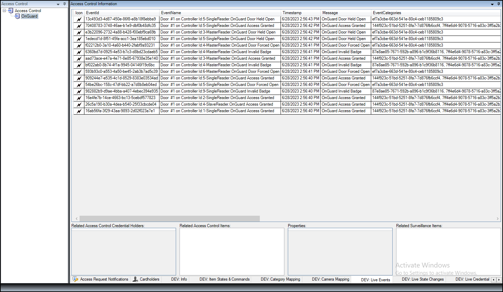

# XProtect Access developer tabs (explained)

Hidden tabs are built into the XProtect Access instance in the Management Client. These tabs contain helpful information when troubleshooting.

{width=75%}