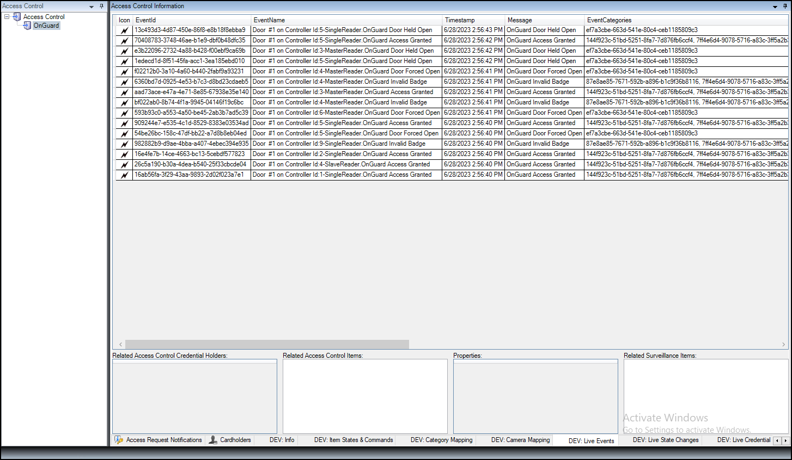

# Developer tabs (reference)

Below is a description of how to use each of the hidden developer tabs available within the XProtect Access instance.

=== "DEV:Info"    
    | Tab Name  | Description   |
    |-----------|---------------|
    | DEV: Info  | 	This tab has the entire hierarchy of servers, devices, statuses, commands, and events in the system. Selecting an individual object allows for identification of any properties associated to it.   | 

    

=== "DEV:Item States & Commands"    
    | Tab Name  | Description   |
    |-----------|---------------|
    | DEV: Item States & Commands  | 	This tab shows all devices and servers in the system. Select a device or server to view all associated commands and possible statuses. The current state of the device or server is displayed in bold.   | 

    

=== "DEV: Category Mapping"  
    | Tab Name  | Description   |
    |-----------|---------------|
    | DEV: Category Mapping  | 	The Category Mapping tab is primarily used for debugging during development making sure that the Events, Commands, States, Servers, and Devices are mapped correctly between OnGuard and XProtect.   | 

    

=== "DEV: Camera Mapping"    
    | Tab Name  | Description   |
    |-----------|---------------|
    | DEV: Camera Mapping  | 	This tab displays the current camera to device mapping used in the XProtect Access instance.   | 

    

=== "DEV: Live Events"
    | Tab Name  | Description   |
    |-----------|---------------|
    | DEV: Live Events  | 	This tab will display live events as they're received by the XProtect Access system when selected. If the client is closed, or the user switches to another view, the Live Events tab won't retain any memory of the events displayed. This memory-less behavior is something all three Live tabs have in common.   | 

    

=== "DEV: Live State Changes"    
    | Tab Name  | Description   |
    |-----------|---------------|
    | DEV: Live State Changes  | 	This tab displays the live status changes of devices and servers. This tab has no memory.   | 

    

=== "DEV: Live Credential Holder Changes"
    | Tab Name  | Description   |
    |-----------|---------------|
    | DEV: Live Credential Holder Changes  | 	This tab shows all credentials added to the XProtect Access system. This tab has no memory.   | 

    
***