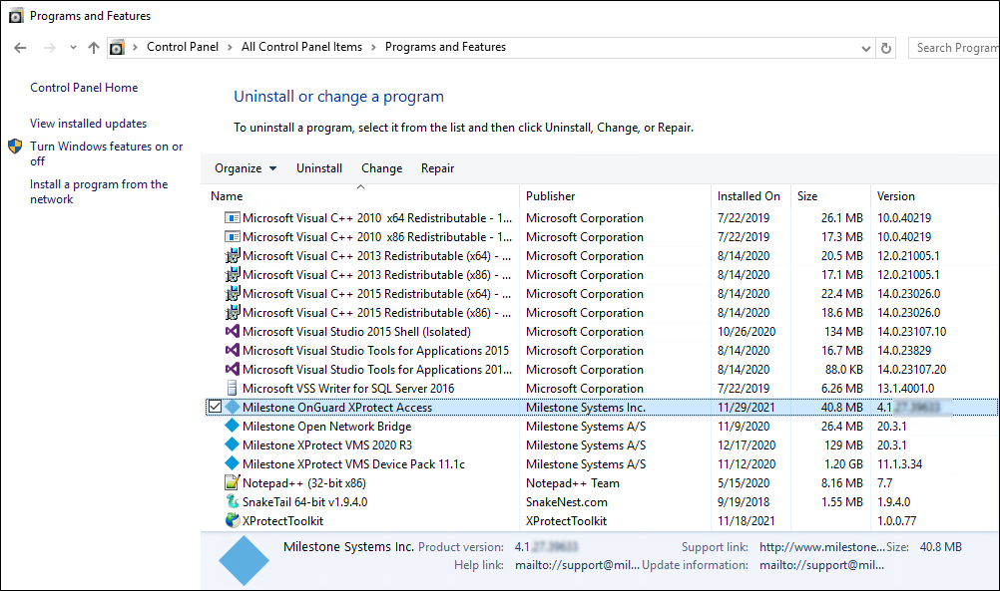

# Integration version downgrades

Here is the process required to uninstall the 4.3 version of the plugin.

1. Go to the **Programs and Features** menu on the Milestone server. Uninstall the Milestone OnGuard XProtect Access program. 
     
    {width=75%}
2. Go to the **Program and Features** menu on the OnGuard server. Uninstall the Milestone OnGuard XProtect Access component
3. [Download](https://download.milestonesys.com/LenelS2xpa/) the old version of the integration.
4. On the OnGuard server: re-install the OnGuard XProtect Access Service.
5. On the Milestone server: re-install the OnGuard XProtect Access MipPlugin.
6. Open the XProtect Management Client. Reconfigure any connection properties in the **General Settings** tab of the XProtect Access instance as needed. Save the settings. Refresh the configuration of the XProtect Access instance.