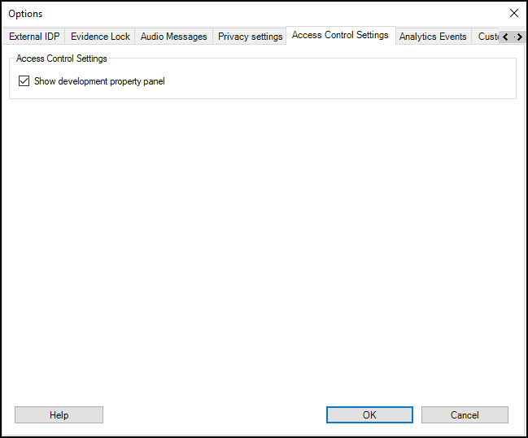

# Enabling developer tabs

Take these steps to enable the hidden developer tabs built into the XProtect Access instance.

1. Select **Options** from the **Tools** menu of the Management Client.
2. Go to the **Access Control Settings** tab of the **Options** dialog and select the **Show development property panel** option.

