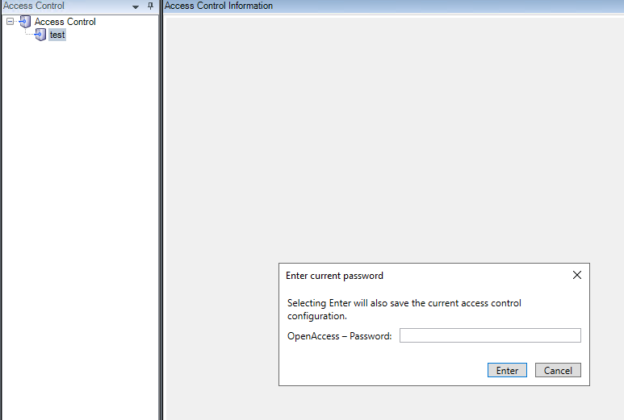
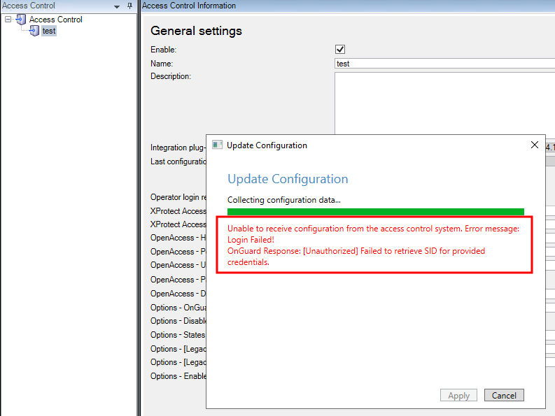

# XProtect 2021 R1 and R2 shows no error if OpenAccess - password is incorrect.

When running XProtect VMS 2021 R1 or 2021 R2, if a change to the configuration on any XProtect Access integration in the **General Settings** tab is saved, the system prompts for a password. This is the password for the account that authenticates between XProtect and the integrated access control system. If the wrong password is provided, there is no error or warning displayed and the integration is broken, without any warning, until the password is changed again to the correct one.

This issue can occur during every XProtect Management Client session when the XProtect Access system configuration changes. When any information or setting controlled within the XProtect Access integration section of the Management Client is changed and saved, the system asks for a password.

To verify the correct settings are in place for the password and all other parameters controlling the connection between integrated access control systems and the XProtect Event Server, use the **Refresh Configuration** feature each time after entering the password, and each time the settings on the **General Settings** page change. If the connection breaks because the password is wrong, then the refresh configuration process produces an error.

