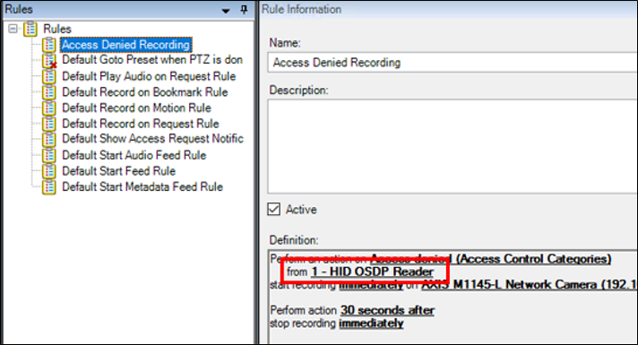

# Access control rules stop working after upgrade to 4.0 or newer.

In versions 4.0 and newer of the XProtect Access LenelS2 OnGuard integration doors can't be a source for access control events or event categories in the XProtect VMS rule system. For existing rules to continue to function, and for new rules, readers must be the source for all events. To fix broken rules after a system upgrade, the source door objects must be replaced by the associated reader objects. Edit the existing rules, remove the doors as the source and replace them with readers. Below is the process to perform this change.

1. Find all access control related rules in the XProtect **Rules** menu. Right-click each individual rule, and select **Edit Rule...** from the shortcut menu. 
     
    
2. Click the door hardware object used as the source of the event. 
     
    {width=50%}
3. The **Select Sources** window opens. Expand the source directory to identify the door hardware object(s) matching the **Selected** hardware objects. Associated to that door hardware object are one or more reader hardware objects.
4. Choose the correct reader associated to the door for this rule. 
     
    {width=50%}
5. Select the reader hardware object from the directory and click the **Add** button.
6. Select the door hardware object from the **Selected** list, and click the **Remove** button. 
     
    {width=50%}
7. Finish editing the rule.
8. Perform this same process for all access control related rules in the XProtect VMS. Check the rules by selecting a rule and verifying the hardware object used as the source. 
     
    