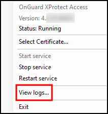
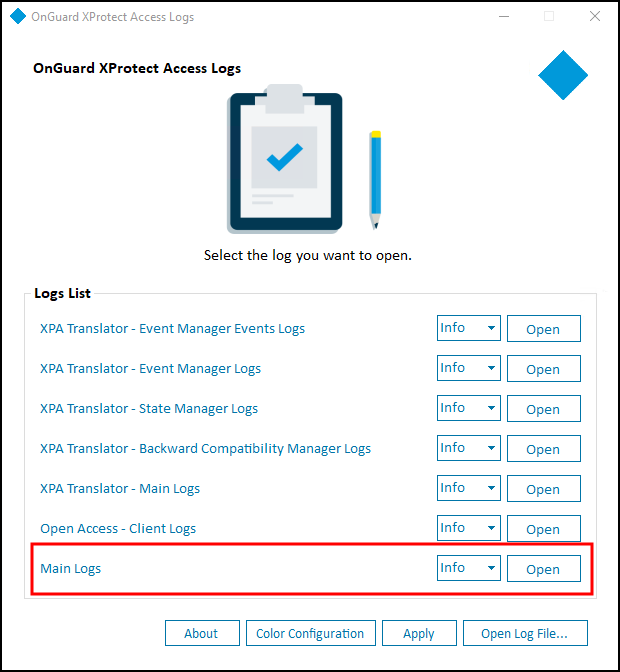
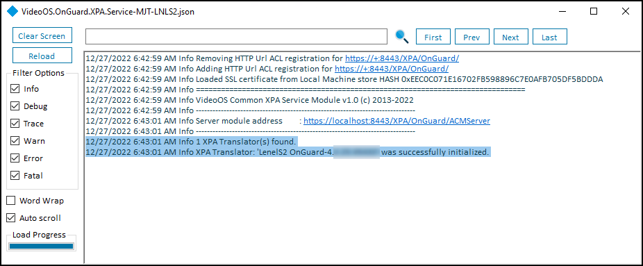

# OnGuard XProtect Access Service: MipPlugin post-install verification

Verify the MipPlugin (located on the XProtect Event Server host machine) was installed by checking the logs, following these steps:

1. Right-click the OnGuard XProtect Access Service tray icon, and select **View logs** from the shortcut menu.</br>
    </br>
    
2. Choose to open the **Main Logs** from the log viewer application.</br>
    </br>
    
3. Verify that the following entries are in the log file:

``` txt
Info 1 XPA Translator(s) found.

Info XPA Translator: 'LenelS2 OnGuard-4.x.xx.xxxxx' was successfully initialized.
```

