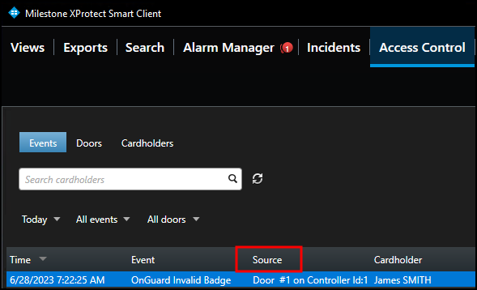
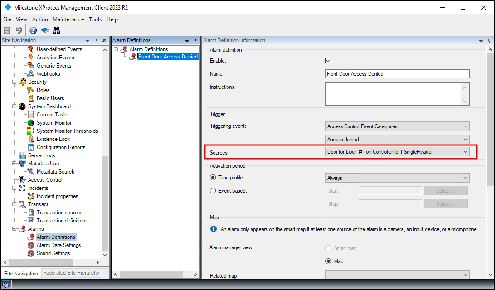
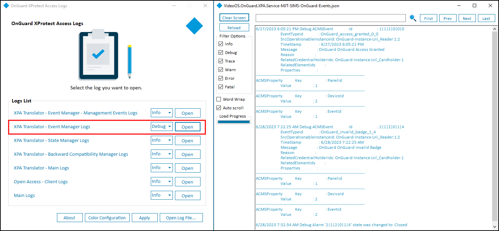

---
hide:
  - toc
---
# Basic support checklist

For issues not covered in this guide, please contact Milestone Support at support@milestone.us, or by phone at 503-350-1100.

Simple items can lead to support calls if overlooked. Below is a short list of those items. First are the items to check on the XProtect Access system, followed by a list of things to verify on the OnGuard system. For both, make sure the versions of the OnGuard system and the XProtect system are supported.

## XProtect Access

??? abstract "Start Here"
    + Check that the doors in XProtect Access are licensed.
    + Check that the doors in XProtect Access are enabled.
    + Verify the XProtect Access Service is running. 
        + Check the service tray icon on the server where the XPA service is installed to verify.
    >
    > 
    >
    + Make sure the Event Server connection to the XPA service is connected.
    + Double check that the credentials used for the OpenAccess user and password fields are correct.

??? abstract "Events, alarms and status problems"
    + Verify all required doors and other devices from the OnGuard system are added to the XProtect Access system.
        + As devices change over time, it's suggested to refresh the configuration from the General Settings tab.
    + Check that events are displayed in the Smart Client access control workspace Events List.
        + Make sure there are no filters applied which might be changing the results.
    + Check that events are being displayed in the Management Client when the Live Events dev tab is displayed
    + Match the Source of events appearing in the Smart Client access control workspace to any Alarms defined in the Alarm Definition menu of the Management Client.
        + Smart Client event source location:
    >
    > 
    >
        + Management Client Alarm Definition source location:
    >
    > 
    >
    + Open the log viewer application and check the following logs to verify your events are received by the XProtect Access Service:
        + XPA Translator - Event Manager Logs
            + Change the log level to Debug and Apply the change. Send some events into the system and then Open the log file.
    >
    > 
    >
    + Open the MIP Plugin logs at this location to verify that the events are received by the Event Server:
        + C:\ProgramData\VideoOS\VideoOS.OnGuard.XPA.MipPlugin\VideoOS.Event.Server\logs
    
!!! success "Milestone Diagnostics Tool"
    In order to have all of the log information that might be required to help troubleshoot event issues, it is recommended to use the Milestone Diagnostics Tool. Read about how to use this tool, and how to gather log data, [here](https://doc.milestonesys.com/latest/en-US/portal/htm/chapter-page-diagnostics-tool.htm?tocpath=Tools%20%2526%20Architecture%7CMilestone%20Diagnostics%20Tool%7C_____0" title="Milestone Diagnostics Tool).

## OnGuard

+ Check that the required [OnGuard services](https://supportcommunity.milestonesys.com/s/article/Lenel-OnGuard-XPA-Integration-not-receiving-OpenAccess-events-ACM-troubleshooting?language=en_US) are running.
+ Check SQL server configuration for the OnGuard system. This process is detailed in a knowledge base article [here](https://supportcommunity.milestonesys.com/s/article/Lenel-OnGuard-XPA-Integration-not-receiving-OpenAccess-events-ACM-troubleshooting?language=en_US).
    + This step requires running a SQL query using SQL Server Management Studio and potentially modifying the configuration.

!!! success "Advanced"
    If all of these attempts to fix event communication fail contact Milestone technical support. There are additional tools, such as the OnGuard Event Subscriber tool, which can be used to gather all event communication on an OnGuard system and output it to a text file for further troubleshooting. This tool is only available through support.